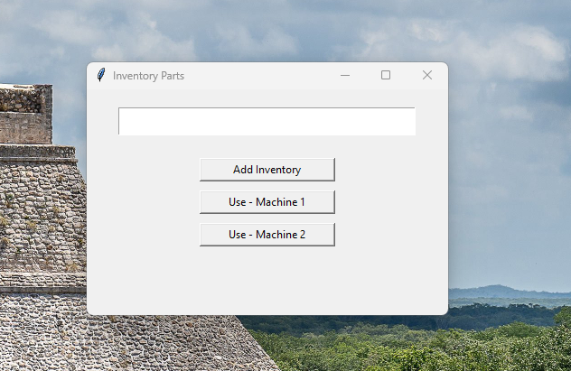
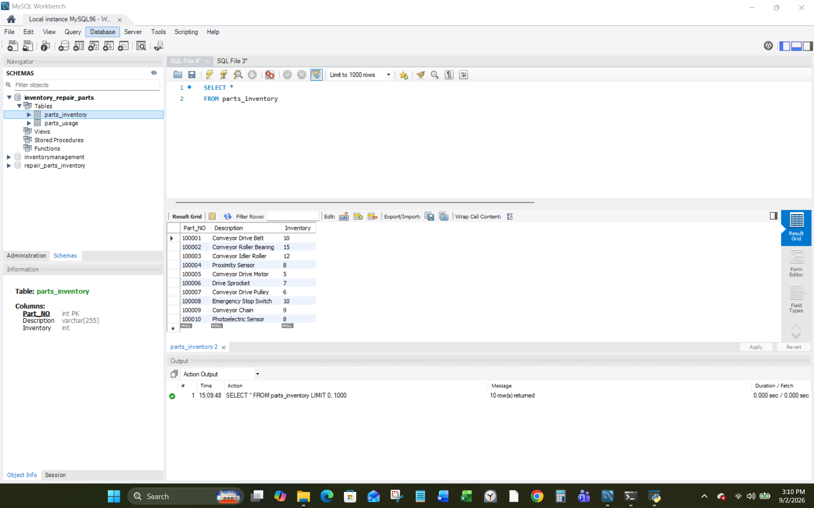
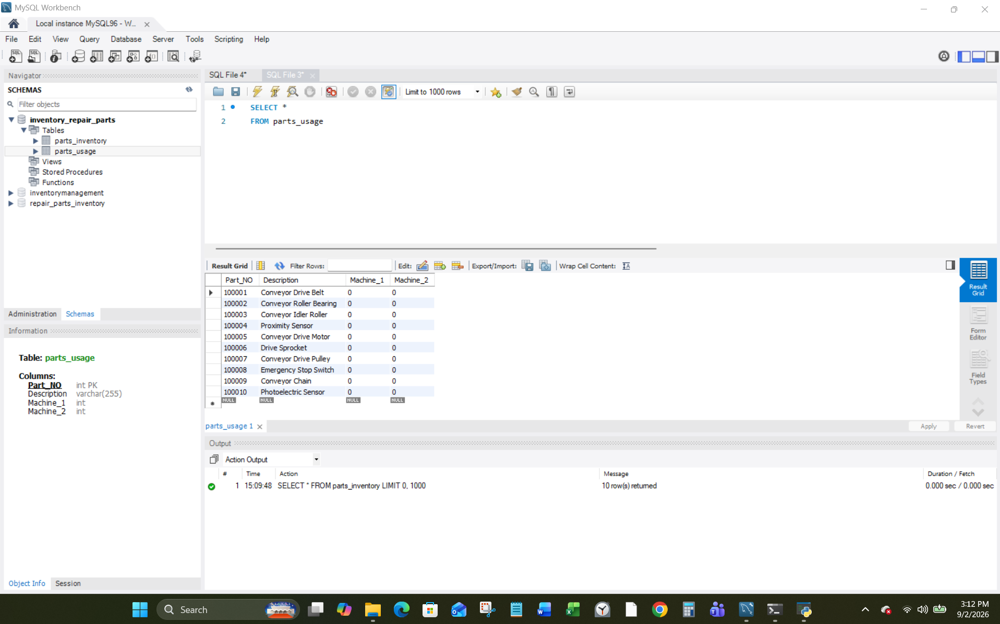
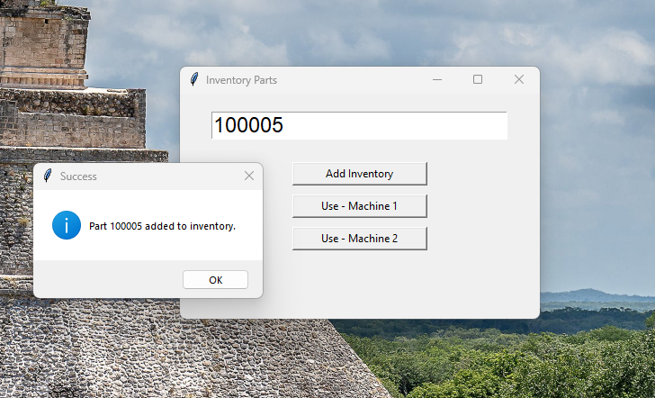
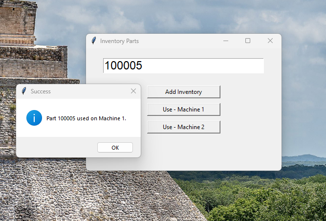
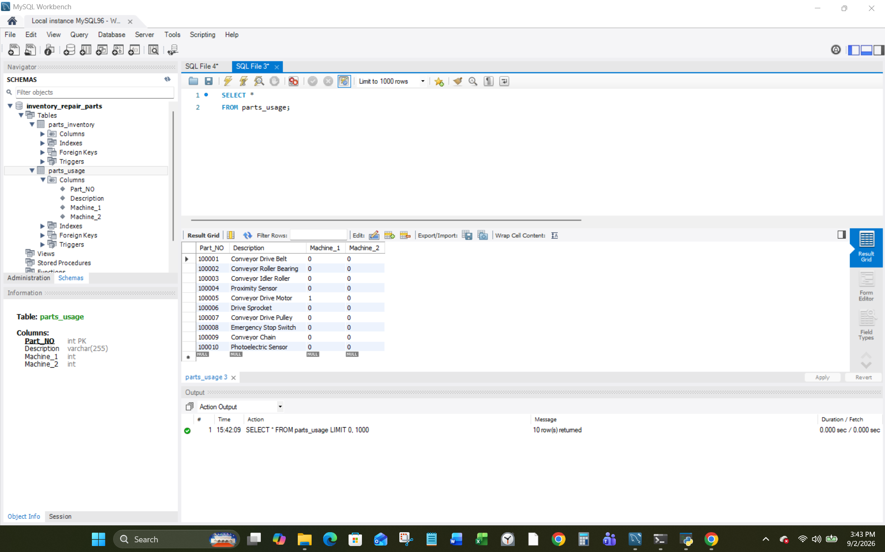
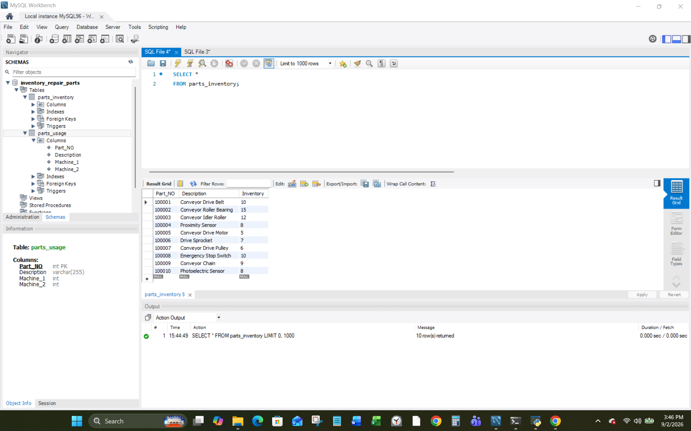

# Py_Tkinter_App

> **Copyright © 2026 Felix Soto Toro. All rights reserved.**  
> *This project is provided for viewing and portfolio purposes only. No permission is granted to copy, modify, distribute, or use this code without prior written permission.*

---

## 📌 Overview

**Py_Tkinter_App** is a Python/Tkinter inventory management application designed to simplify the tracking of machine parts and maintenance inventory. 

The application uses **MySQL** to manage part information and inventory levels. It supports scanning or entering part numbers, adding and removing stock, and recording parts used on **Machine 1** or **Machine 2**. It provides a simple, intuitive interface for maintaining accurate, real-time inventory records and helps reduce manual tracking during equipment maintenance.

---

## 📽 App Walkthrough & Interface Demonstration

Below is a step-by-step visual demonstration showing how the Tkinter application interacts in real time with the MySQL database during standard maintenance workflow actions.

### 1️⃣ Initial System State

The main Tkinter interface features an input field optimized for USB barcode scanners alongside targeted action buttons:

> **

#### Baseline Database Records
Before performing any action, observe the starting data across both tracking tables:
* **`parts_inventory` Table:** Part number `100005` (**Conveyor Drive Motor**) starts with **5 units**.
* **`parts_usage` Table:** The `Machine_1` and `Machine_2` columns on all rows read **0**.

 ### `parts_inventory` Table  and `parts_usage` Table 

 > **  
 > ** 

---

### 2️⃣ Adding Stock via Barcode Scanner

Using a barcode scanner, part number `100005` is scanned directly into the app, followed by clicking the **Add Inventory** button.

1. **Scan:** Part number `100005` is inserted into the app.
2. **Action:** Click **Add Inventory**.
3. **Confirmation:** A **Success** message box displays on screen.

> **

#### Database Result
The `parts_inventory` table instantly reflects the transaction, increasing the **Conveyor Drive Motor** stock count from **5 to 6**.

> **

---

### 3️⃣ Logging Part Consumption on Machine 1

Next, the same part number (`100005`) is used to log a part replacement event by clicking the **Use - Machine 1** button.

1. **Scan:** Part number `100005` is re-entered into the app.
2. **Action:** Click **Use - Machine 1**.
3. **Confirmation:** A **Success** message box displays on screen.

> **

#### Dual Table Real-Time Synchronization
The operation automatically completes two updates simultaneously across the database:

1. **Machine Usage Logged:** The `parts_usage` table updates the `Machine_1` column for the **Conveyor Drive Motor** row from **0 to 1**.
   > **

2. **Stock Auto-Deducted:** Simultaneously, the `parts_inventory` table decrements the **Conveyor Drive Motor** inventory back down from **6 to 5**.
   > **

## 🛡️ Exception & Error Management

The application incorporates built-in error handling routines to manage unexpected inputs barcode scans and other errors. Please refer to the Python file for full implementation details.
