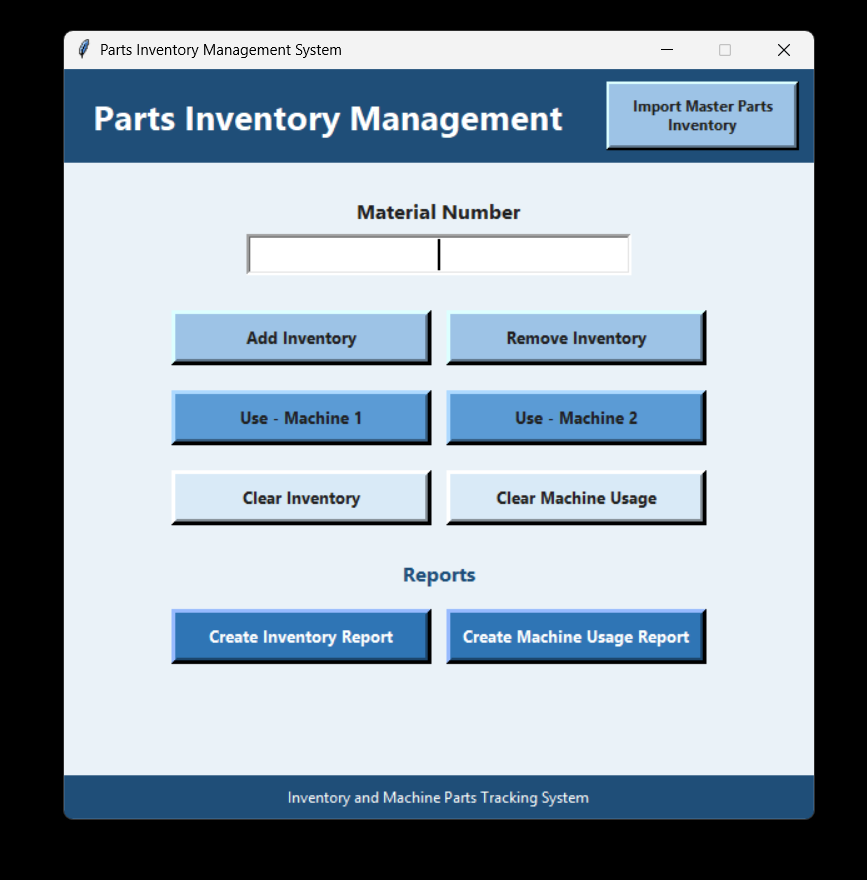
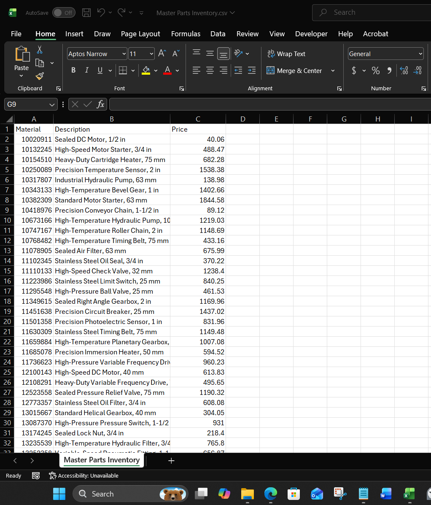
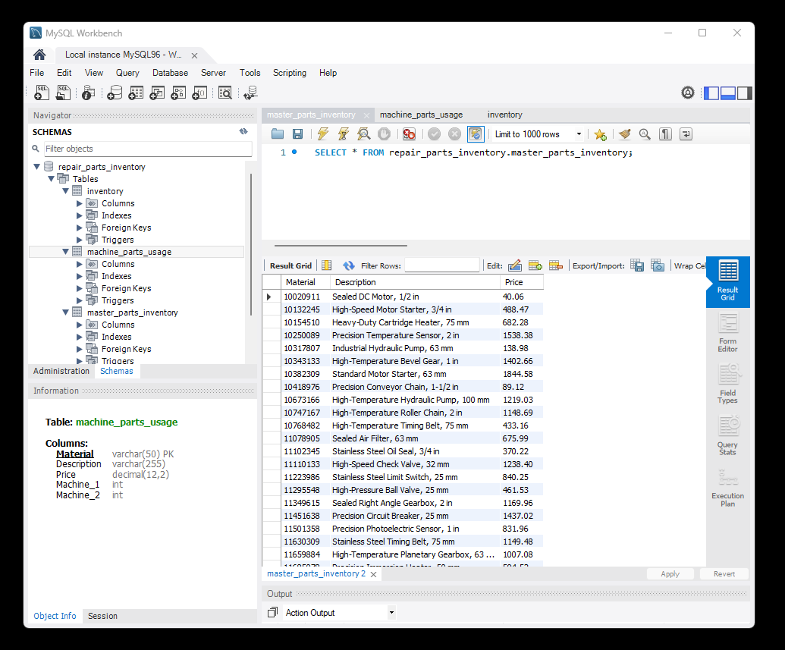

# Py_Tkinter_App

> **Copyright © 2026 Felix Soto Toro. All rights reserved.**  
> *This project is provided for viewing and portfolio purposes only. No permission is granted to copy, modify, distribute, or use this code without prior written permission.*

---

# ⚙️ Parts Inventory Management System

### Python • Tkinter • MySQL

*A simple desktop application for tracking machine parts, inventory, and equipment usage.*

---

## 📦 Overview

The **Parts Inventory Management System** provides a simple interface for managing machine parts without requiring users to work directly with the database.

### The application allows users to:

- 📥 Import a Master Parts Inventory
- ➕ Add and remove parts from inventory
- 🔎 Enter or scan material numbers
- 🔧 Record parts used on Machine 1 or Machine 2
- 📊 Track current inventory quantities
- 📄 Generate inventory and machine usage reports
- 🗄️ Store inventory information in a MySQL database
- 🗄️ Reports are automatically saved in a folder named: Parts Inventory Quarterly Reports

The application can automatically create the required **MySQL database and tables** when the Master Parts Inventory is imported.

---

## 🖥️ Application Interface

---

## 🗄️ Database

The application uses **MySQL** to store the Master Parts Inventory, current inventory, and machine parts usage.

  

---

## 🎬 Video Demonstration

For a complete explanation of how the application works, watch the full video demonstration.

The video provides a detailed walkthrough of importing parts, managing inventory, recording machine usage, generating reports, and viewing the MySQL database.

### ▶️ [Watch the Full Application Demonstration](https://www.youtube.com/watch?v=RuG-JghGlY0)

---

## 🛠️ Technologies Used

| Technology | Purpose |
|:---:|:---|
| 🐍 **Python** | Application Development |
| 🖥️ **Tkinter** | Desktop User Interface |
| 🗄️ **MySQL** | Database Management |
| 📋 **SQL** | Database Operations |
| 🔗 **MySQL Connector** | Python/MySQL Connection |
| 📄 **CSV** | Inventory Imports & Reports |

---

## 👨‍💻 Author

**Felix Soto Toro**

*Independent Application Developer*

---

### ⚙️ Parts Inventory Management System

**Python • Tkinter • MySQL**

